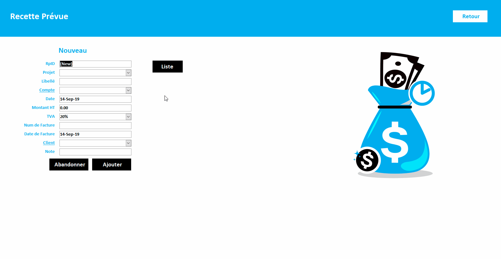
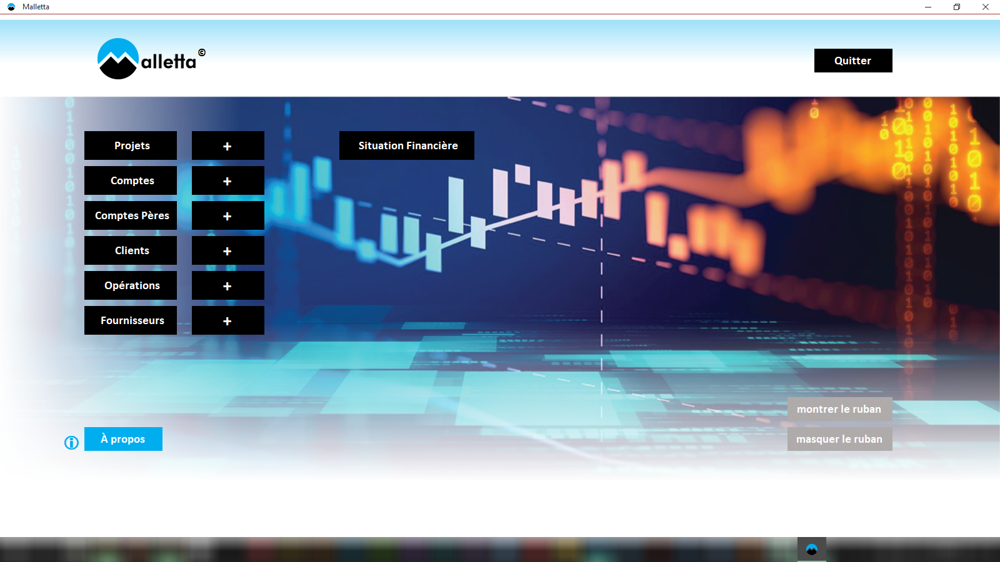
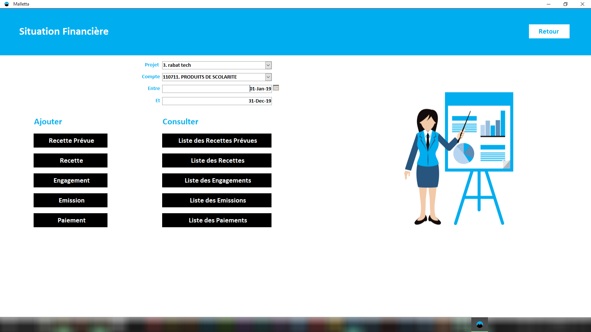
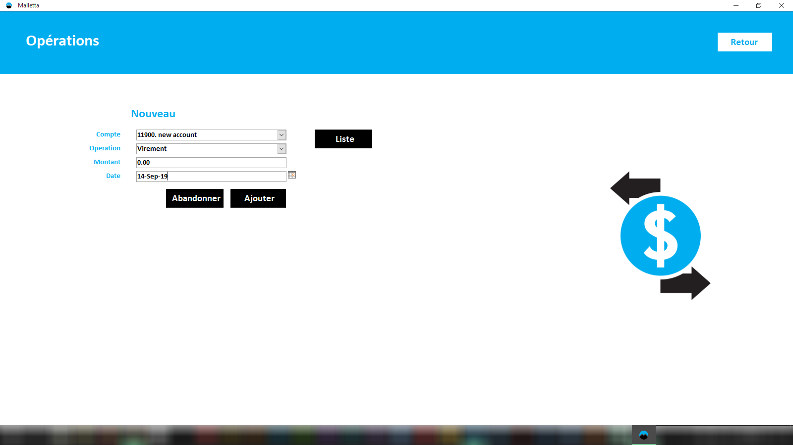
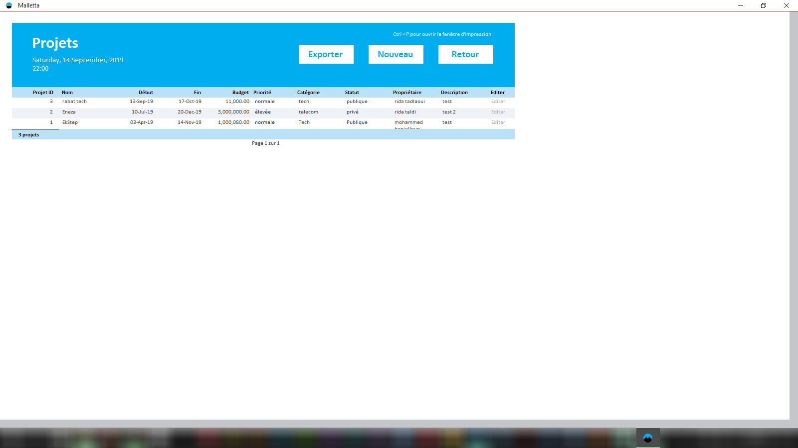

# Malletta: A User-Friendly Access Database

This project was the subject of my second year internship.  
Malletta Database is a desktop application that allow the INPT's financial department to enter, store and edit data along with applying calculations and filters, in order to get more relevant and useful data.


## Features

* Data integrity
* Security
* User-friendly interface
* Navigable
* Buttons and Tooltips
* Automated calculations (TVA,...)
* Filters (By project, account, date, ...)
* Shortcut links to speed up the process

## Tools

* Visual Basic for Applications
* Access macros
* SQL

## Installation

1. Make sure you have a recent version of Microsoft Access installed on your machine. If not, download [Microsoft Access 2016 Runtime](https://www.microsoft.com/en-us/download/confirmation.aspx?id=50040 "access 2016 runtime download").
2. Double click to open production version.
3. Double click and hold shift to open the `development` version of the database.
4. Enter the default password : 0000
5. Add project, account and sub account items before everything else. (you need them to be available when creating the rest of the structure!)

## Development Version

> You may want to remove this code from the welcome page load event in the development version to toggle on the **ribbon** and have it visible by default.

``` Visual-basic
Private Sub Form_Load()
DoCmd.ShowToolbar "Ribbon", acToolbarNo
End Sub
```

## Using Shortcut Links



## The Home Page



## A Submenu



## Exemple of a Form Page

Used for data entry.



## Exemple of a Report Page

A report prepare data to be printed or exported in many formats.



## More Stuff

Check out some of my other project on my [personal website](https://abdelar.github.io "My Personal Website"). You can follow me on [LinkedIn](https://www.linkedin.com/in/elaroussi/ "My LinkedIn Page") or check out my [art portfolio](https://www.behance.net/elaroussi "My Behance Page").
